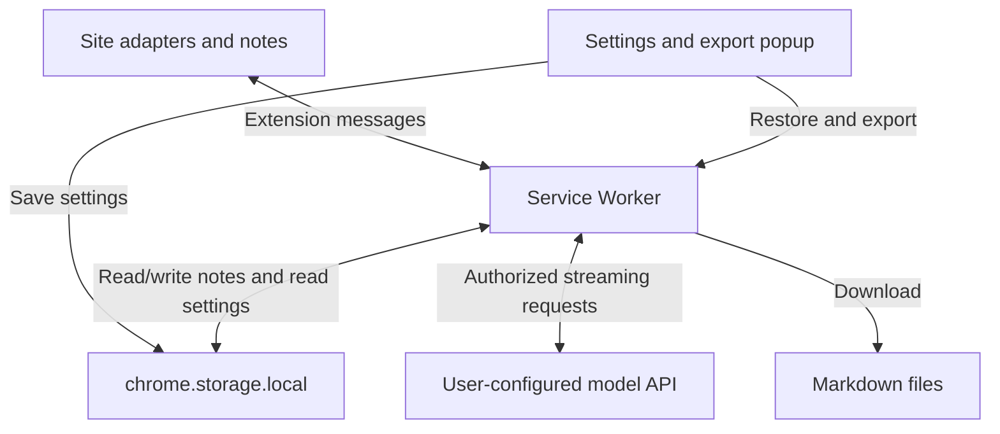

# Agent Sidenote

[中文](README.md) | [English](README.en.md)

**Ask follow-up questions beside an AI response, then save what you learn as notes.**

While reading a long AI response, a term or a code snippet often needs a closer look. Adding every follow-up to the main conversation can make the original thread harder to follow. Agent Sidenote is a Chrome extension built for this everyday workflow: open a note beside the passage, ask follow-up questions, and export the useful parts to Markdown.

- **Ask in place:** select text in a ChatGPT, Doubao, or Gemini response and start a separate sidenote conversation.
- **Keep the reading context:** quote the passage, include context when needed, and save notes per conversation page for later restoration.
- **Build lasting notes:** add types, marks, and tags; export individual notes or merge them by page into Markdown for Obsidian and other tools.

Uses Chrome Manifest V3 with no build step. Try the interface in Mock mode, or use your own key and an OpenAI Chat Completions compatible service in API mode. The current interface and response instructions are primarily in Chinese; this README provides English documentation.

Jump to: [Installation](#installation) · [Privacy and permissions](#privacy-and-permissions) · [Architecture](#architecture)

## Installation

1. Download and extract this repository's ZIP, or run `git clone https://github.com/hyandnn/agent-sidenote.git`.
2. Open `chrome://extensions` and enable **Developer mode**.
3. Choose **Load unpacked** and select the repository directory containing `manifest.json`.

## Configuration

1. Click the extension icon and select **API** mode. **Mock** mode lets you try the interface without a key.
2. Enter your API key, model, and Base URL, then click **测试连接** (Test connection) and **保存设置** (Save settings).

Testing the connection sends a test request to the configured API service. Mock mode does not call a model API. See [Privacy and permissions](#privacy-and-permissions) for access scope and revocation.

## Usage

1. Open [chatgpt.com](https://chatgpt.com), [doubao.com/chat](https://www.doubao.com/chat/), or [gemini.google.com](https://gemini.google.com/).
2. Select text in an AI response and click **旁注追问** (Ask in a sidenote).
3. Ask questions in the note and set its type, marks, and tags.
4. Click **Save as Note**, or use **导出 Markdown** (Export Markdown) in the popup.

Closing a note hides its window; the note remains available for export. Use **恢复当前页便签** (Restore notes on this page) in the popup to reopen it. During a request, **停止** (Stop) cancels generation and preserves the response received so far.

## Privacy and permissions

### Local data and API keys

Notes, settings, and API keys are stored locally in `chrome.storage.local`. The extension does not add encryption to the API key; this storage is not a credential vault. Uninstalling the extension clears its stored data, while downloaded Markdown files remain. The extension provides no note cloud sync and includes no analytics or telemetry uploads.

### Content sent to the model

In API mode, the extension sends the selected passage, nearby context, current question, recent sidenote history, and any enabled full-response or main-conversation context to the API service you configure. The API key is included in the `Authorization` request header. The service's own policies determine how it handles this content.

You can disable full-response and main-conversation context in settings. The selected passage, nearby context, and sidenote question are still sent. Prefer HTTPS; HTTP endpoints transmit the API key and request content without encryption. Requests do not follow redirects, so enter the final API address.

### Chrome permission purposes

| Permission | Purpose and scope |
| --- | --- |
| Required site access | Read selections and conversations and display notes on HTTPS pages at `chatgpt.com`, `chat.openai.com`, `www.doubao.com`, `doubao.com`, and `gemini.google.com` |
| Optional API host access | Requested when you test or save settings, for the specific protocol and host of your API; Chrome host grants cover that host's ports and paths |
| `storage` | Save local notes, settings, and export state |
| `tabs` | Get the current page URL to scope notes, restoration, and exports |
| `downloads` | Save Markdown and update export state after downloads complete |

The `https://*/*` and `http://*/*` entries in `manifest.json` declare the **optional** range needed for custom APIs. They do not grant all-site access by default at installation. Denying API access leaves previous settings intact. Saving a new API host clears old API grants; saving Mock mode clears API grants. Click **撤销 API 授权** (Revoke API access) to revoke access, and test or save again to reauthorize it. Manage access to the required supported sites in Chrome's extension details.

Response rendering sanitizes HTML, retaining basic Markdown formatting and HTTP/HTTPS links.

## Updating

After updating the code, reload the extension in `chrome://extensions`, then refresh the AI conversation pages. Existing notes migrate automatically. Export state is tracked per file; the first export after upgrading from the older tracking scheme regenerates files.

Upgrading from older versions clears the wildcard grant for all HTTPS sites. Before using API mode again, test the connection or save settings to authorize the current API host.

## Export location

Enter a subdirectory **relative to Chrome's download directory**. Absolute paths and `..` are not supported.

### Default

Leave the field empty or enter `Notes` to save files under `~/Downloads/Notes/` when using Chrome's default download directory.

### Obsidian Inbox

On macOS / Linux, you can set up a symbolic link once, then enter `Note/00_Inbox` in the extension:

```bash
mkdir -p ~/Note/00_Inbox ~/Downloads/Note
ln -s ~/Note/00_Inbox ~/Downloads/Note/00_Inbox
```

Set **Markdown 保存子目录** (Markdown export subdirectory) in the popup to `Note/00_Inbox`.

See [`docs/note-format.md`](docs/note-format.md) for the Markdown file format (Chinese).

## Troubleshooting

**Save as Note fails?** Reload the extension and try again. Check that the export subdirectory contains neither `..` nor an absolute path.

**No selection button on Doubao?** Make sure you selected text in the body of an AI response.

**Unexpected behavior after reloading the extension?** Refresh the AI conversation page.

**A note was updated in another window?** Preserve any unsaved edits in this window, then refresh the page to load the latest version.

**API access missing or revoked?** Open the extension settings and click **测试连接** (Test connection) or **保存设置** (Save settings). Base URL accepts an HTTP/HTTPS root address, a `/v1` address, or a full `/chat/completions` endpoint. Enter the final address; requests do not follow redirects.

## Architecture

Site adapters extract selections and the current conversation. Notes communicate with the Service Worker through extension messages. The worker handles note writes, authorized API requests, and Markdown downloads. The popup manages settings, authorization, restoration, and export previews.



| Module | Responsibility |
| --- | --- |
| `content/adapters/` | Extract messages, roles, and context from the three sites |
| `content/` | Selection button, note UI, safe rendering, and page navigation |
| `background/` | Serialized saves, streaming requests, and download completion checks |
| `shared/` | Note schema, export rules, message clients, and API permissions |
| `popup/` | Settings, API authorization, and export controls |

## Verification

Load the extension directly; no build is needed. Tests require Node.js 20 or newer. DOM test dependencies are not used by the extension at runtime:

```bash
npm ci
npm test
```

Regression coverage includes fixtures for all three sites, selection and note restoration, concurrent storage updates, export consistency, streaming failures, download state, and API authorization. Tests use hand-written HTML fixtures and mocked Chrome APIs. They do not replace browser acceptance against live site DOMs; full live-browser acceptance across the three sites remains outstanding. See [tests/fixtures/README.md](tests/fixtures/README.md) for fixture provenance and acceptance steps.

## License

Project code is licensed under the [MIT License](LICENSE), Copyright (c) 2026 Haoling Yang.

Third-party libraries retain their own licenses. See [THIRD_PARTY_NOTICES.md](THIRD_PARTY_NOTICES.md).
