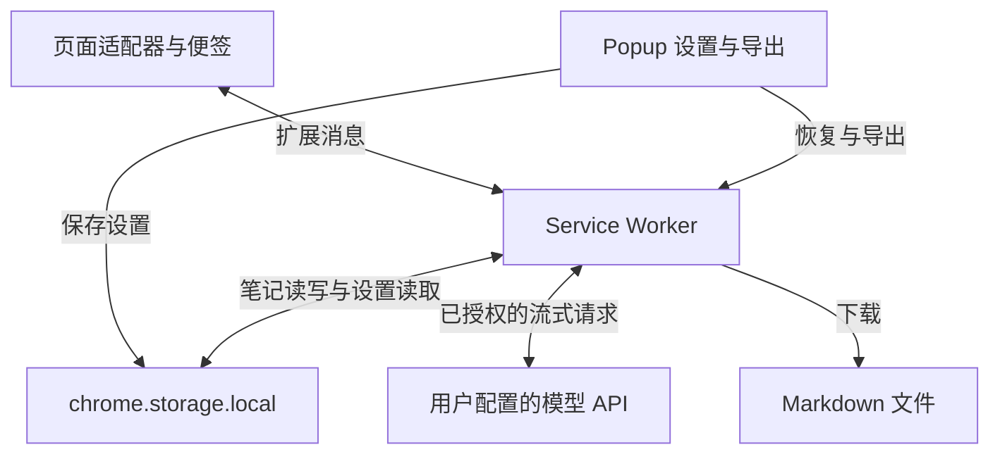

# Agent Sidenote

[中文](README.md) | [English](README.en.md)

**在 AI 回答旁边追问，把理解过程保存成笔记。**

阅读 AI 的长回答时，一个术语或一段代码常常需要继续追问。把这些问题放回主对话，会让原来的阅读线索越来越难找。Agent Sidenote 是为这个日常需求做的 Chrome 扩展：在原文附近打开旁注，多轮追问，再把值得保留的内容导出为 Markdown。

- **就地追问**：在 ChatGPT、豆包、Gemini 的回答中选中文字，创建独立的旁注对话。
- **保留阅读现场**：引用原文，按需携带上下文；便签按对话页面保存，可关闭后恢复。
- **沉淀成笔记**：添加类型、标记和标签，导出单条或按页面合并的 Markdown，接入 Obsidian 等笔记工具。

支持 Chrome Manifest V3，无需构建。Mock 模式可直接体验；API 模式使用你自己的 Key 和兼容 OpenAI Chat Completions 的服务。当前界面与回答提示主要使用中文。

跳转：[安装](#安装) · [隐私与权限](#隐私与权限) · [架构](#架构)

## 安装

1. 下载本仓库的 ZIP 并解压，或运行 `git clone https://github.com/hyandnn/agent-sidenote.git`
2. 打开 `chrome://extensions`，开启 **开发者模式**
3. **加载已解压的扩展程序** → 选择包含 `manifest.json` 的仓库目录

## 配置

1. 点击扩展图标，模式选 **API**（Mock 模式无需 Key，可体验 UI）
2. 填写 API Key、模型、Base URL → **测试连接** → **保存设置**

测试连接会向配置的 API 服务发出一条测试请求；Mock 模式不调用模型 API。授权范围和撤销方式见[隐私与权限](#隐私与权限)。

## 使用

1. 打开 [chatgpt.com](https://chatgpt.com)、[doubao.com/chat](https://www.doubao.com/chat/) 或 [gemini.google.com](https://gemini.google.com/)
2. 在 AI 回答中选中文字 → **旁注追问**
3. 便签中提问，设置类型 / 标记 / 标签
4. **Save as Note** 或 Popup **导出 Markdown**

关闭便签只隐藏窗口，仍可导出；Popup 的 **恢复当前页便签** 可重新打开已关闭的便签。请求期间可点击 **停止**，已收到的回答会保留。

## 隐私与权限

### 本机数据与 API Key

笔记、设置和 API Key 保存在本机的 `chrome.storage.local` 中。扩展没有对 API Key 额外加密，这份存储不是密码保险箱；卸载扩展会清除其中的数据，已下载的 Markdown 文件仍会保留。扩展不提供笔记云同步，也不内置统计或遥测上传。

### 发送给模型的内容

API 模式将选中的原文、附近上下文、当前问题、最近的旁注历史，以及启用的完整回答和主对话上下文发送给你配置的 API 服务。API Key 随请求放在 `Authorization` 请求头中。服务商如何处理这些内容，取决于该服务的政策。

设置中可关闭完整回答和主对话上下文；选中的原文、附近上下文和旁注问题仍会发送。优先使用 HTTPS；HTTP 地址不会加密传输 API Key 和请求内容。请求不自动跟随重定向，请填写最终 API 地址。

### Chrome 权限用途

| 权限 | 用途与范围 |
| --- | --- |
| 固定站点访问 | 读取支持页面的选区和对话，显示便签；范围为 `chatgpt.com`、`chat.openai.com`、`www.doubao.com`、`doubao.com`、`gemini.google.com` 的 HTTPS 页面 |
| 可选 API 主机访问 | 点击测试或保存时，只申请所填 API 的具体协议和主机；Chrome 的主机授权覆盖该主机的各端口和路径 |
| `storage` | 保存本机笔记、设置和导出状态 |
| `tabs` | 获取当前页 URL，限定便签、恢复和导出的范围 |
| `downloads` | 保存 Markdown，并在下载完成后更新导出状态 |

`manifest.json` 中的 `https://*/*` 和 `http://*/*` 是为自定义 API 声明的**可选**范围，不是安装时默认授予的全站访问。拒绝 API 授权不会覆盖原设置；保存新 API 主机后会清理旧 API 授权，保存 Mock 模式会清理 API 授权。可点击 **撤销 API 授权**，再次使用时重新测试或保存；固定支持站点的访问权限在 Chrome 扩展详情中管理。

回答渲染会过滤 HTML，仅保留基本 Markdown 排版与 HTTP/HTTPS 链接。

## 更新

更新代码后，在 `chrome://extensions` 重新加载扩展，再刷新 AI 对话页面。已有笔记会自动迁移，无需手动转换。新版按文件记录导出状态，首次导出会重新生成文件。

从旧版升级后会清理全部 HTTPS 网站的通配授权；API 模式首次使用前，请重新测试连接或保存设置，为当前 API 主机授权。

## 保存路径

路径填写规则：**相对 Chrome 下载目录的子路径**，不支持 `..` 和绝对路径。

### 默认

留空或填 `Notes` → 使用 Chrome 默认下载目录时，文件在 `~/Downloads/Notes/`。

### 写入 Obsidian Inbox

在 macOS / Linux 上，可一次性设置符号链接，之后插件填 `Note/00_Inbox`：

```bash
mkdir -p ~/Note/00_Inbox ~/Downloads/Note
ln -s ~/Note/00_Inbox ~/Downloads/Note/00_Inbox
```

Popup → **Markdown 保存子目录** 填 `Note/00_Inbox`。

Markdown 文件格式见 [`docs/note-format.md`](docs/note-format.md)。

## 常见问题

**Save as Note 报错？** 重载扩展后重试；检查保存子目录是否含 `..` 或绝对路径。

**豆包无反应？** 确保选中的是 AI 回复正文。

**重载扩展后异常？** 刷新 AI 对话页面。

**提示笔记已在其他窗口更新？** 先保留本窗口尚未保存的内容，再刷新页面加载最新版本。

**API 尚未授权或授权已撤销？** 打开扩展设置，点击 **测试连接** 或 **保存设置**。Base URL 支持 HTTP/HTTPS 的根地址、`/v1` 地址或完整的 `/chat/completions` 地址，请直接填写最终地址；请求不自动跟随重定向。

## 架构

页面适配器提取选区与当前对话，便签通过扩展消息交给 Service Worker。后者统一处理笔记写入、已授权的 API 请求和 Markdown 下载；Popup 负责设置、授权、恢复与导出预览。



| 模块 | 职责 |
| --- | --- |
| `content/adapters/` | 三站点的消息、角色和上下文提取 |
| `content/` | 选区按钮、便签 UI、安全渲染与页面切换 |
| `background/` | 串行保存、流式请求与下载完成确认 |
| `shared/` | 笔记结构、导出规则、消息客户端与 API 权限 |
| `popup/` | 配置、API 授权及导出操作 |

## 验证

扩展直接加载，无需构建。测试使用 Node.js 20 或更新版本；安装的 DOM 测试依赖不参与扩展运行：

```bash
npm ci
npm test
```

回归检查覆盖三站点结构样本、选区与便签恢复、存储并发、导出一致性、流式异常、下载状态和 API 授权流程。测试使用人工构造的 HTML 样本和模拟的 Chrome API，不能替代网站实时 DOM 的浏览器验收；三站点完整的真实浏览器验收仍待完成。样本说明与验收步骤见 [tests/fixtures/README.md](tests/fixtures/README.md)。

## 许可

项目代码采用 [MIT License](LICENSE)，Copyright (c) 2026 Haoling Yang。

第三方库保留各自的许可，详见 [THIRD_PARTY_NOTICES.md](THIRD_PARTY_NOTICES.md)。
